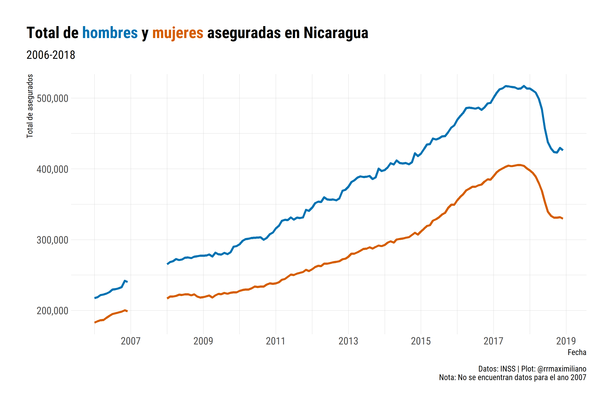

<!-- README.md is generated from README.Rmd. Please edit that file -->

# Estadísticas del Instituto de Seguridad Social de Nicaragua

Este repositorio contiene datos extraídos de los reportes de los
anuarios estadísticos del Instituto de Seguridad Social de Nicaragua.
Los datos se encuentran en la subcarpeta `data` en formato `csv` y
`rds`.

## Por género

Las variables en esta base son:

-   `year`: año
-   `gender`: género
-   `edad`: grupo de edad
-   `mes`: mes
-   `asegurados`: cantidad de asegurados activos

``` r
inss
#> # A tibble: 3,744 x 5
#>     year gender  edad  mes   asegurados
#>    <dbl> <chr>   <chr> <chr>      <dbl>
#>  1  2018 Hombres 0-14  ene           72
#>  2  2018 Hombres 0-14  feb           82
#>  3  2018 Hombres 0-14  mar           60
#>  4  2018 Hombres 0-14  abr           51
#>  5  2018 Hombres 0-14  may           42
#>  6  2018 Hombres 0-14  jun           39
#>  7  2018 Hombres 0-14  jul           33
#>  8  2018 Hombres 0-14  ago            5
#>  9  2018 Hombres 0-14  sep            3
#> 10  2018 Hombres 0-14  oct            4
#> # ... with 3,734 more rows
```

## Por régimen

Las variables en esta base son:

-   `year`: año
-   `month`: mes
-   `regimen`: tipo de régimen (i.e., facultativo y obligatorio)
-   `asegurados`: cantidad de asegurados activos

``` r
inss_reg
#> # A tibble: 624 x 4
#>     year month   regimen              asegurados
#>    <dbl> <chr>   <chr>                     <dbl>
#>  1  2006 Enero   Obligatorio Integral     340891
#>  2  2006 Enero   Obligatorio IVM           56440
#>  3  2006 Enero   Facultativo Integral       1678
#>  4  2006 Enero   Facultativo IVM            1400
#>  5  2006 Febrero Obligatorio Integral     344008
#>  6  2006 Febrero Obligatorio IVM           56327
#>  7  2006 Febrero Facultativo Integral       1694
#>  8  2006 Febrero Facultativo IVM            1436
#>  9  2006 Marzo   Obligatorio Integral     351033
#> 10  2006 Marzo   Obligatorio IVM           53626
#> # ... with 614 more rows
```




## Caveats

Actualmente este repositorio no contiene información del anuario del año
2007.

## Comentarios y sugerencias

Para realizar comentarios o sugerencias sobre la base de datos puedes
abrir un issue en este repositorio:
<https://github.com/RRMaximiliano/inss_nicaragua/issues>
